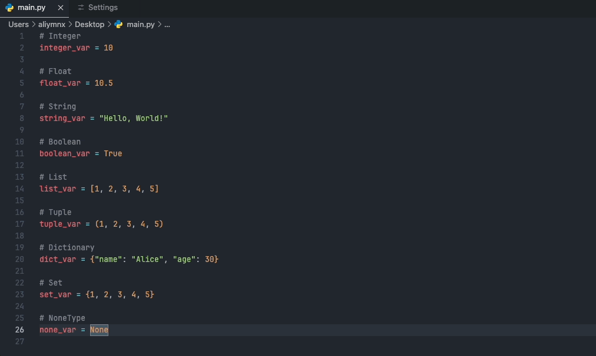

# Python Colorful Print

A shortcut that allows us to print in color in Python.

# Vscode Extension

This extension is available for free in the [Visual Studio Code Marketplace](https://marketplace.visualstudio.com/items?itemName=AliYaman.python-colorful-print)

# How to use
You can just Press Cmd+Shift+L (Mac), or Ctrl+Shift+L (Windows)
